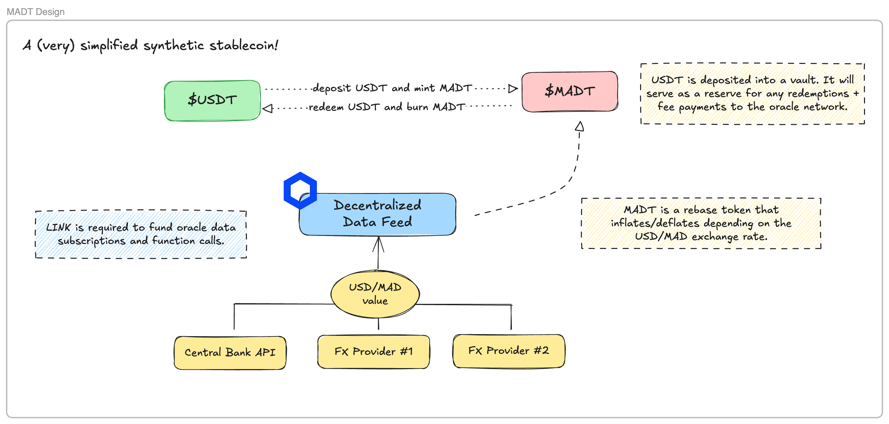

# Synthetic Stablecoin Design - $MADT

For educational purposes only.

## Overview

This project is a proof-of-concept for a synthetic stablecoin pegged to the value of the US Dollar. In this repository, we implement a vault contract that holds the collateral and a MADT contract that is minted to users in exchange for a dollar-pegged stablecoin. In this case, we are using the USDT stablecoin.

A previous version of this project is available in the [old](old) directory. I have migrated this codebase to use Foundry instead of Hardhat.

## Prerequisites

- [Foundry](https://getfoundry.sh/)

## High-level Design

## To-do

_Tehcnicals_

- [ ] Refactor the MADT & vault's contracts
- [ ] Add mock consumers for the Chainlink Oracle
- [ ] Establish fee structure for the vault
- [ ] Add a script to deploy the contract and mint MADT to the owner
- [ ] Add a script to burn MADT from the owner
- [ ] Write tests for the contract

_Docs_

- [ ] More details on the general architecture (especially the rebase mechanism).
- [ ] More details on potential use cases.
- [ ] Potential issues & mitigations.
