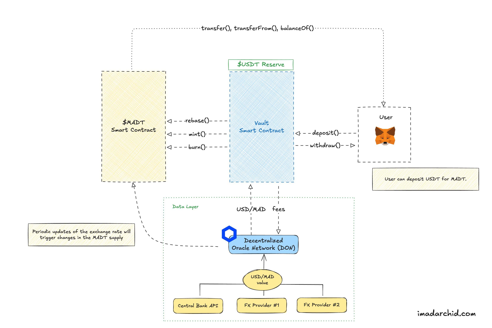

# Synthetic Stablecoin Design - $MADT

For educational purposes only.

## Overview

This project serves as a proof-of-concept for a synthetic stablecoin pegged to the US Dollar. In this repository, we implement two key contracts: a Vault contract, which securely holds the collateral, and a MADT (Moroccan Dirham Token) contract, which is minted and distributed to users in exchange for a dollar-pegged stablecoin (USDT).  

A previous version of this project used Hardhat as a development framework. I have migrated this codebase to use Foundry instead.

## Prerequisites

- [Foundry](https://getfoundry.sh/)
- Install the dependencies: `forge install`
- Compile the contracts: `forge build`

### How to run the project

- `make fct-anvil`: Launches a local Anvil node.
- `make simulate-don`: Launches the local DON simulator. Wait until the DON is ready.
- `make deploy-all`: Deploys all the contracts to a local node.

## High-level Design

General architecture of the project:

Data provider architecture:

## Architecture

This project uses Chainlink Functions in order to fetch the exchange rate of the Moroccan Dirham (MAD) to the US Dollar (USD).

Read about Chainlink Functions [here](https://docs.chain.link/functions/introduction).

Locally, we use a simulated DON environment to test the integration of the Chainlink Functions. We borrowed the implementation from the [Chainlink Functions Toolkit](https://github.com/smartcontractkit/functions-toolkit) repository. 

## Folder Structure

- `src/`: Contains the source code for the contracts.
- `test/`: Contains the test files for the Vault contract. I will add more tests soon.
- `script/`: Contains the script files to deploy MADT, a mock USDT stablecoin, and the Vault contract. It also contains a script to facilitate interactions with the Vault. This directory also contains a helper script to deploy the contracts to a local node.
- `don-simulator/`: Contains the implementation of the simulated DON environment. It also has the source code that is sent to the DON for fulfillment.

## Contract Overview

### MADT.sol

The MADT contract is a standard ERC20 contract that is used to represent the Moroccan Dirham Token.

### Vault.sol

The Vault contract is a standard ERC20 contract that is used to hold the collateral for the stablecoin. It is used to mint MADT to users in exchange for (USDT).

### DataProvider.sol

The DataProvider contract is a standard Chainlink Functions contract that is used to fetch the exchange rate of the Moroccan Dirham (MAD) to the US Dollar (USD). This contract is based on the [Chainlink FunctionsClient contract](https://github.com/smartcontractkit/chainlink/blob/develop/contracts/src/v0.8/functions/v1_0_0/FunctionsClient.sol).

### MockUSDT.sol

The MockUSDT contract is a standard ERC20 contract that is used to represent the mock USDT stablecoin.

## Easier interactions using Make

The project includes several make commands to simplify common development tasks:

- `make simulate-don`: Launches the local DON simulator.
- `make deploy-all`: Deploys all the contracts to a local node.
- `make deploy-madt`: Deploys the MADT contract to a local node.
- `make deploy-usdt`: Deploys the mock USDT contract to a local node.
- `make deploy-vault`: Deploys the Vault contract to a local node.
- `make send-request`: Sends a request to the DataProvider contract to fetch the exchange rate of the Moroccan Dirham (MAD) to the US Dollar (USD).
- `make get-last-response`: Gets the last response from the DataProvider contract.
- `make get-last-error`: Gets the last error from the DataProvider contract.
- `make get-last-request-id`: Gets the last request ID from the DataProvider contract.
- `make deposit-collateral`: Deposits collateral into the Vault contract.
- `make redeem-collateral`: Redeems collateral from the Vault contract.
- `make rebase`: Rebases the Vault contract.

## To-do

- [ ] Add more tests for the Vault contract.
- [ ] Deploy to a testnet. 